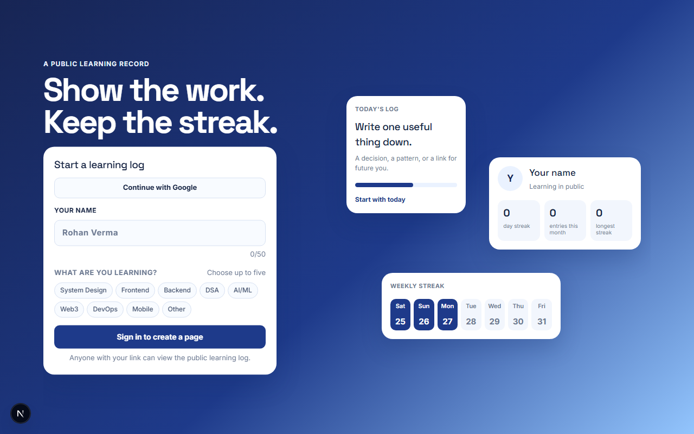
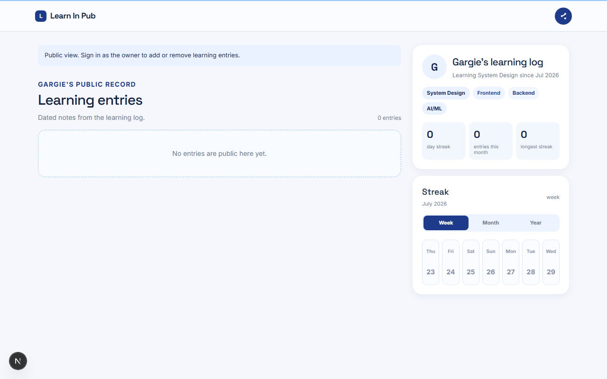
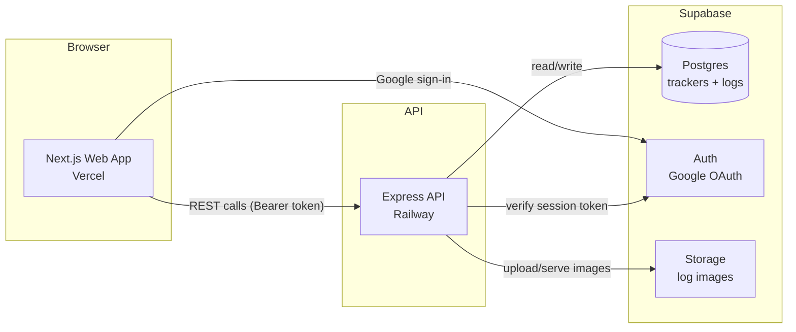
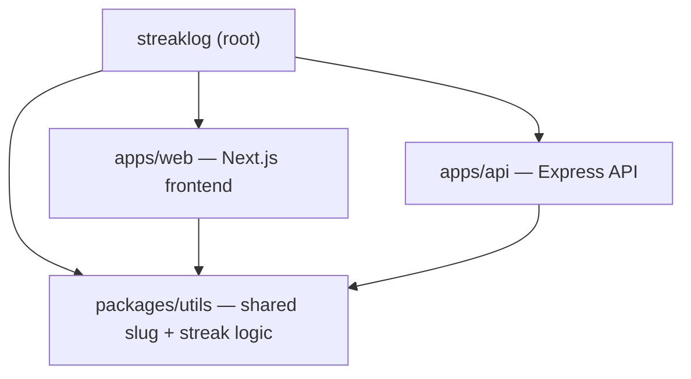
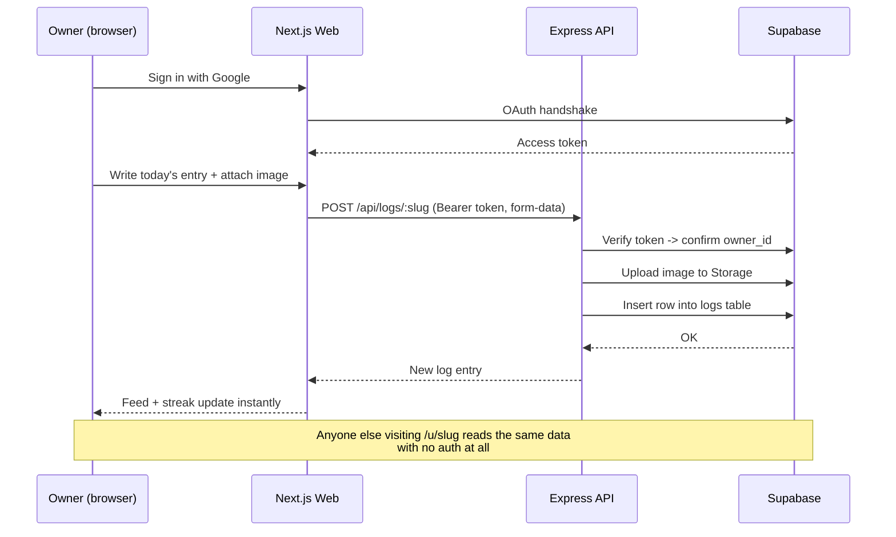

# StreakLog (Learn In Pub)

StreakLog is a **learn-in-public streak tracker**, built as a submission for **Team Shiksha**. Create one public profile, post visual daily learning updates, and share the record with a link — no login required to view it, no matter who you are.

**Live app:** [https://streak-tracker-web.vercel.app/](https://streak-tracker-web.vercel.app/)

## Demo

- Watch on YouTube: [https://youtu.be/0dStiuFgdMs](https://youtu.be/0dStiuFgdMs)
- Or view the recording directly from this repo: [docs/LearnInPub.mp4](docs/LearnInPub.mp4)

## Screenshots

**Landing page — start a learning log**



**Public learning log — shareable by link**



## How it works

1. A visitor lands on the app and signs in with Google.
2. They enter their name and pick what they're learning (up to five topics).
3. The API creates a tracker with a human-readable slug (e.g. `/u/gargie-system-design`) tied to that Google account.
4. Anyone with the link can open `/u/<slug>` and see the public log — entries, streak, and an activity calendar — with **no login at all**.
5. Only the signed-in owner sees the composer to log a new entry (topic tag + note + optional screenshot) for the day.
6. If the owner signs back in later, the app looks up their existing tracker and sends them straight to it instead of showing the signup form again.

## Architecture



**Monorepo layout** (npm workspaces + Turborepo):



## How a log entry gets from browser to public page



## Tech used

| Layer | Choice | Why |
|---|---|---|
| Frontend | Next.js (App Router) + React 19, GSAP for motion | Fast, file-based routing, good fit for a public-page-per-user app |
| Backend | Express (TypeScript) | Small, explicit REST surface — easy to reason about ownership/auth checks |
| Datastore | Supabase (Postgres) | Managed Postgres + Auth + Storage in one, no need to stitch together three services |
| Auth | Supabase Auth (Google OAuth) | Ties ownership to a real identity instead of a token sitting in a URL or localStorage |
| Monorepo tooling | npm workspaces + Turborepo | One shared `utils` package (slugs, streak math) used by both apps, one install, one build graph |
| Web hosting | Vercel | Zero-config Next.js deploys |
| API hosting | Railway | Simple always-on Node service with env-based config |

## Decisions

- **Monorepo + Turborepo:** shared streak and slug utilities stay consistent in one build pipeline instead of copy-pasted logic.
- **Supabase:** managed PostgreSQL, Auth, and public image storage suit a compact full-stack application without extra infra to run.
- **Public by URL:** anyone can view a learning profile, its entries, and its streak without signing in — the core ask of the assignment.
- **Google authentication for ownership:** Google sign-in gives each profile a stable private owner identity, verified server-side via a Bearer token. Only that owner can create or remove logs — the public link itself never carries edit access.
- **One profile per account:** returning users are sent to their existing learning profile rather than receiving a duplicate random slug or re-seeing the signup form.
- **Human-readable slugs:** URLs are easy to share. Different people with the same name and topic get distinct URLs if a collision occurs.
- **Multiple logs per day:** a daily cap of ten prevents spam while still allowing learners to record intense days.

## Local setup

1. Install dependencies: `npm install`.
2. Copy `.env.example` to `apps/api/.env` and `apps/web/.env.local`, then fill in the Supabase values.
3. For a new project, run [supabase/schema.sql](supabase/schema.sql) in the Supabase SQL editor. For an existing project, also run [supabase/migrations/20260728_google_auth.sql](supabase/migrations/20260728_google_auth.sql) once.
4. Start both apps with `npm run dev`. The web app is at `http://localhost:3000`; the API is at `http://localhost:4000`.

## Google sign-in setup

1. In Google Cloud Console, create an OAuth web client and add this authorized redirect URI: `https://your-project-ref.supabase.co/auth/v1/callback`.
2. In Supabase, open **Authentication → Providers → Google**, enable it, and add the Google client ID and client secret.
3. In Supabase **Authentication → URL Configuration**, set the Site URL to `http://localhost:3000` locally and add `http://localhost:3000/**` to Redirect URLs. Add your deployed HTTPS URL and its `/**` variant before deploying.

The browser sends the signed-in user's Supabase access token to the API. The API verifies that token with Supabase before creating a profile or changing logs. Legacy device owner tokens continue to work for profiles created before this upgrade on the browser that created them.

## Deployment

- **Web** (`apps/web`) is deployed to **Vercel** at [streak-tracker-web.vercel.app](https://streak-tracker-web.vercel.app/), with `NEXT_PUBLIC_API_URL` set to the Railway API URL.
- **API** (`apps/api`) is deployed to **Railway**. Because this is an npm-workspaces monorepo, Railway's Root Directory is set to the repo root (not `apps/api`) so the builder can see the shared `packages/utils` workspace, and [`railway.json`](railway.json) scopes the build/start commands to just the API app:
  ```json
  {
    "build": { "buildCommand": "npm install && npm run build --workspace=packages/utils && npm run build --workspace=apps/api" },
    "deploy": { "startCommand": "npm run start --workspace=apps/api" }
  }
  ```
- Configure the listed Supabase environment variables on each platform and add the deployed web URL to Supabase Auth redirect URLs.
